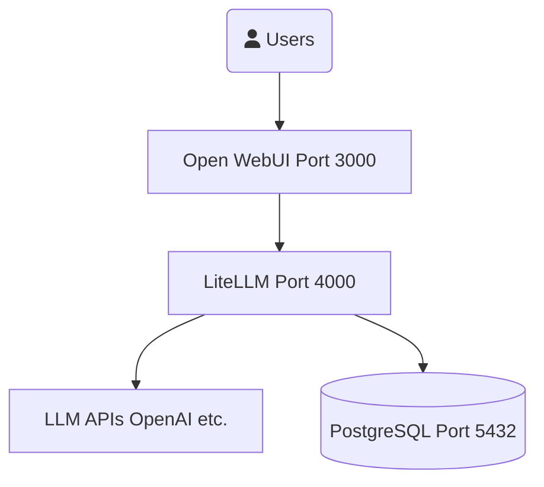

# LiteLLM Setup

## Getting Started

This project uses Docker Compose to run LiteLLM, Open WebUI, and PostgreSQL.

### Installation

1. Clone the repository
2. Make sure you have Docker and Docker Compose installed
3. Run `docker-compose up -d` to start all services

### Environment Variables

The application uses a .env file to manage configuration parameters.
Create a .env file in the project root and add variables such as:
- PORT: Port number for LiteLLM
- DB_HOST, DB_USER, DB_PASS: PostgreSQL database connection info
- API_KEYS: Keys for various LLM providers

### Services

- **LiteLLM**: API proxy for multiple LLM providers - accessible at http://localhost:4000
- **Open WebUI**: Web interface for interacting with LLMs - accessible at http://localhost:3000
- **PostgreSQL**: Database for storing LiteLLM data

## Architecture Diagram



## User Setup

Before using the system, create a user with the following command:

```bash
curl -X POST "http://localhost:4000/user/new" \
  -H "Authorization: Bearer sk-1234" \
  -H "Content-Type: application/json" \
  -d '{"user_id": "default_user_id", "user_email": "user@example.com"}'
```

After creating a user, you can use the system with the generated API key.
